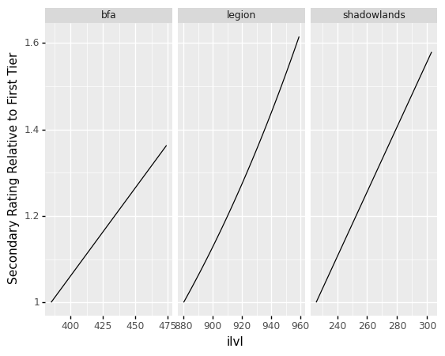
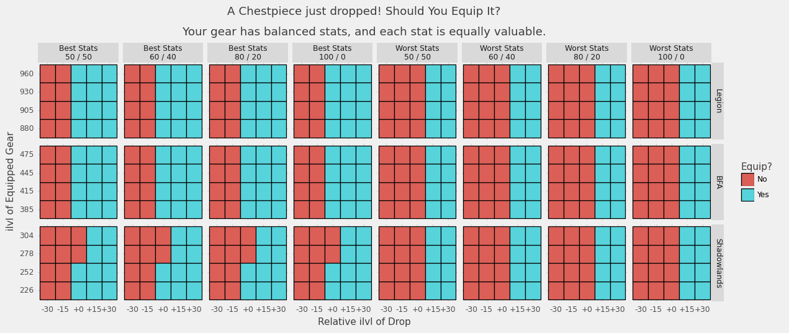
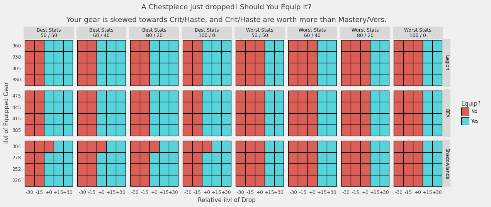
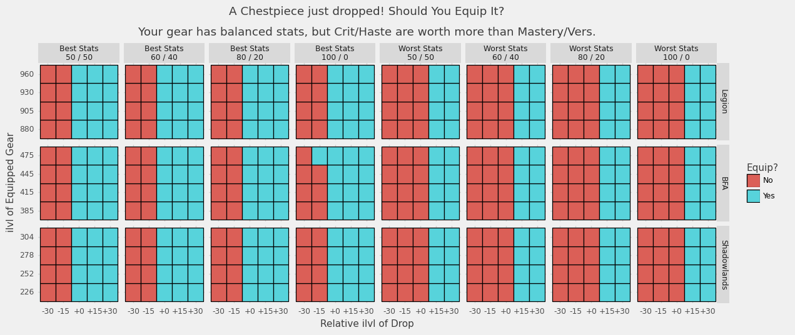
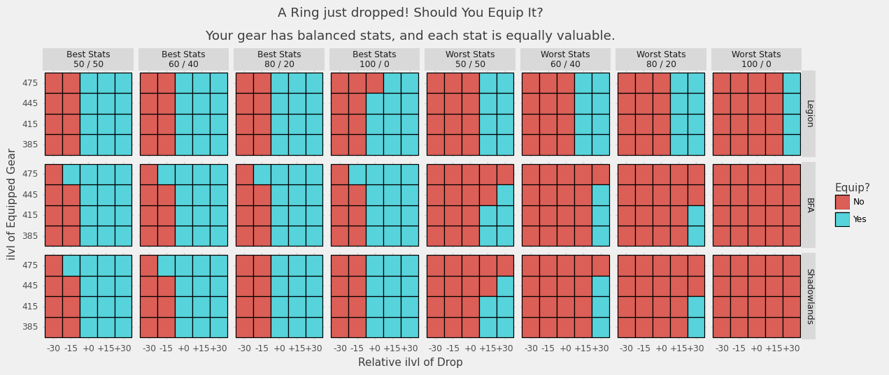
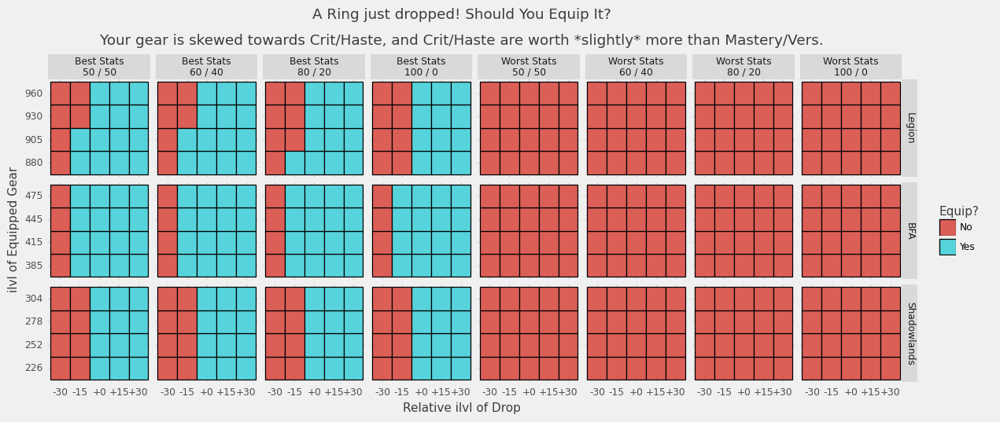
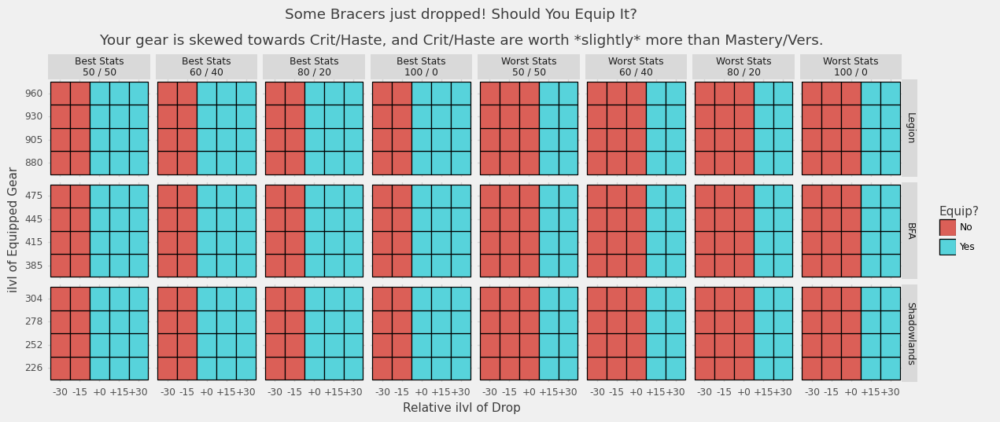
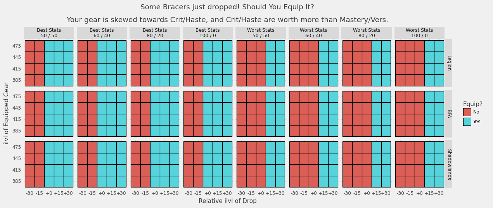
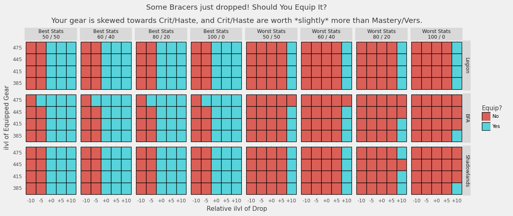

# Evaluating Secondary Stat Scaling Models
*Author: emallson (Eisenpelz-Turalyon NA)*

In *Battle for Azeroth,* Blizzard reduced the rate at which secondary stats
scale relative to prior expansions. To the best of our understanding, this
change was made in an attempt to eliminate (or at least limit) the scenarios
where it was correct to equip lower item level gear to get better stats. While
this change was mostly invisible to the average player, coming as it did during
the ilvl squish, it has been contentious among the theorycrafting community and
the general opinion is that it failed at this purpose.

Recently, we discovered that Blizzard had implemented new *diminishing returns*
on secondary stat scaling on the *Shadowlands* Beta. From my point-of-view, this
change reflects a misunderstanding of the impact of the BFA changes as well as a
frankly concerning willingness to layer new, opaque systems on top of an already
notoriously opaque game.

Nonetheless, much of my (and the wider community's) concerns are based largely
on feelycraft, not concrete analysis. As a result, this week I put together some
concrete  analysis on when it is valuable to drop ilvl for better stats under
each secondary scaling model.

## The Scaling Models

I considered three scaling models, using data collected from the `simc` codebase
to accurately model them.

In terms of implementation, all three are basically identical: there is a
*multiplier table* that attenuates an underlying exponential scaling formula.
The specifics of the multiplier table control how quickly stats grow in each
expansion.



The above chart shows the amount of secondary rating on rings compared to the
first tier. We can see that *Battle for Azeroth* is the slowest, with roughly
*linear* growth of secondaries, with items from Ny'alotha having about 40%
additional secondaries over Uldir items.

*Legion* (at least, after the 7.1 rescaling) is faster. The multipliers used
leave a slight exponential curve in place, but it is heavily attenuated and only
results in 60% stat growth after almost 100 ilvls.

*Shadowlands* has a very clear change, with stats growing much, *much* faster
than in BFA or post-7.1 Legion. However, *Shadowlands* also introduces
diminishing returns on secondary stats, which are not reflected in this chart.
Our concern is that these diminishing returns may lead to awkward gearing
choices by introducing scenarios where it is correct to drop ilvl for "bad"
status simply because they haven't yet hit the heavier diminishing returns.

This analysis is primarily concerned with answering one simple question: when
looking at an item that has just dropped, should you equip it? What if it is an
ilvl upgrade? or downgrade? Let's find out.

## The Damage Model

To evaluate damage properly, we'd need to use a tool like *simulationcraft.*
Rather than attempt to retrofit different scaling models into simc, I have
instead opted for a simplified model that should still capture much of the
behavior we are interested in.

Let me begin with an example: *Keg Smash.* Keg Smash is a Brewmaster Monk
ability which has its base damage determined by your *Attack Power* (defined as
`Agility * (1 + Mastery%)`). Its damage scales with versatility, increasing the
damage done per cast by `1 + Vers%`. Similarly, the average damage over many
casts increases with your critical strike, adding a factor of `1 + Crit%` over
the course of a fight. Lastly, the cooldown of Keg Smash is hasted, so the
number of casts you get over the course of a fight is increased by a factor of
`1 + Haste%`. The average damage of Keg Smash over the course of a fight is:

```
number of casts * avg damage per cast = Agility * (1 + Mastery%) * (1 + Vers%) * (1 + Crit%) * (1 + Haste%)
```

Not every ability scales with every stat, but this kind of scaling on key
rotational abilities is very common. I am going to use this formula, with a
small tweak, as a proxy for actual damage done over the course of a fight.
Specifically:

```
Avg Damage = Mainstat * (1 + MasteryValue * Mastery%) * (1 + VersValue * Vers%) * (1 + CritValue * Crit%) * (1 + HasteValue * Haste%)
```

The introduction of these `StatValue` parameters lets us model specs that scale
better or worse with particular stats. Using Brewmaster as an example again: BrM
has a fixed rotation, and so gets very limited value from Haste. Thus,
`HasteValue` would be close to 0. At the same time, Mastery doesn't impact any
of the procs that BrM (and, to a lesser extent, other tanks) have come to rely
on for damage, so it would be less valuable than either Crit or Vers.

Then we can estimate the gain in damage done by upgrading an item by subtracting
the `Avg Damage` for some baseline gear from the `Avg Damage` of the upgraded
gear.

The next question, then, is how to determine the stats in use. That process goes like this:

1. Pick a stat scaling model. For example: the BFA model.
2. Pick an average item level for your gear.
3. Generate *base stats* for your gear at that ilvl using the model.
4. Calculate `Avg Damage` using those stats. This is the *baseline damage.*
5. Pick an ilvl and stat breakdown for a new item.
6. Generate the stats for that item using the model.
7. Calculate `Avg Damage` using the *base stats* plus the *item stats* minus the stats of the old item in that slot. This is the *upgraded damage.*
8. Calculate the *value of the upgrade* with `upgraded damage - baseline damage`

We can repeat this process with different items at different ilvls and stat
breakdowns to figure out when it is valuable to drop ilvl in order to improve
stats.

## Results



The main question we want to answer is this: should you equip an item that just
dropped? The chart above shows when it is beneficial to equip an item that has
dropped with various different ilvls and stat breakdowns.

Note that *most* items in modern WoW have two stats on them. You'll get a
Crit/Haste piece or a Mastery/Vers piece, and only rarely a pure-Crit or
Crit/Haste/Mastery/Vers piece. The items that are generated for this use two
stats (either your best two or worst two) in one of several combinations.

Your best and worst stats are determined by calculating which stats have the
largest gain per point relative to your equipped gear. (Technically: this is
done via automatic gradient calculation)

For example: the top-left section of the grid uses your two best stats in a
50/50 split. As you move right, the skew gets more extreme until you hit the 5th
box and we switch over to items with your worst stats.

This chart in particular shows that for each system, if you have even stats and
balanced gear you should always take an ilvl upgrade. This is the kind of
behavior that the devs have stated they're looking for.

Main-slot pieces like chest and legs are fairly stable. Even with fairly large
skew on your stats, it is virtually never valuable to drop ilvl under any model.



Interestingly, when you have heavily skewed secondary values but balanced stats,
it *can* be worth dropping ilvl on main pieces---but only under the BFA model
and only in extreme cases.



This pattern of "ilvl > stats" appears to remain constant on pieces that have mainstat (so:
everything but rings---we aren't touching trinkets here).

### The Ring Problem

Rings, though. Rings get *wild.*

Lets start off with an easy one: your stats are all equally valuable, and your
gear has balanced stats. That means you should always take ilvl on rings, right?
Well...



In *Legion,* you would have gone with ilvl in all but the most extreme cases.
From BFA onward, though, it is often worth dropping ilvl (especially in later
tiers). The changes in *Shadowlands* appear to fix this, with it virtually
always being worthwhile to upgrade an item with a higher ilvl version.

As an aside: *Shadowlands* appears to use 13 ilvls between difficulties instead
of 15. That is not reflected in these charts, but the principle remains similar.



When you have skewed gear *and* slightly skewed secondaries, it becomes clear
that the *BFA* changes were counterproductive---but that the *Shadowlands*
changes actually improve the situation substantially even over the *Legion*
model. In particular: in Legion it was worth dropping ilvl in to get your best
stats, and worth skipping ilvl upgrades to avoid your worst stats. In *BFA,* the
number of cases in which it was correct to drop ilvl for better stats increased.

Let's take a moment to return to another time: 2015. Hellfire Citadel has
released, and inside you can find rings that would seem out-of-place in modern
WoW. Why? Well, they have primary stat on them. In fact, rings in Warlords (and
possibly prior, this is hard to tell) were identically scaled to bracers now. As
a result, we can check what the results look like for bracers and see how things
would behave if the Legion change (removing mainstat from rings) were reverted:



Keep in mind that the *Legion* section here is actually identical to *Warlords*
ring scaling. This, in fact, is the behavior that Blizzard states they would
like to see on gear now: it is always correct to equip ilvl upgrades, and never
correct to equip ilvl downgrades. Further, this behavior holds *even when your
stats are heavily skewed!*




Interestingly, when you reduce the ilvl gap between items the problem appears
again under all models---though it is certainly least-bad in *Shadowlands*. Note
that this only occurs in practice due to Warforging, which indicates that the
frequency with which people dropped ilvls for better stats in *Legion* and *BFA*
may, in fact, be a byproduct of the Warforging/Titanforging system giving us
many items with small gaps between them.



## Wrapping Up

While I had initially been quite skeptical about the value of the secondary DR
system, this analysis has largely assuaged my concerns. Specifically, I was
concerned about two things: (1) that this change may increase the situations
where it was correct to ignore ilvl, and (2) that this might have awkward
breakpoints where the answer to "should I ignore ilvl?" changed. Neither of
these appear to be the case.

In additional, while I did not include information on which stats were "best"
within each cell of the charts above, examination of the logs used to generate
them reveals that the DRs are not severe enough to devalue the secondaries your
spec might naturally want. That is: if Crit and Haste are good stats for you,
they remain good stats even with the presence of DRs.

That said: I am still somewhat concerned about the introduction of yet another
opaque system to the game. *Battle for Azeroth* introduced another, similar
opaque system: defensive scaling (i.e. armor, block, Stagger) getting reset
every tier by the increase of an underlying constant (`K`). This system has been
frustrating not from a theory PoV, but from that of a player. However, the
effects of that system (resetting tank power every tier, which honestly sucks)
are quite different from the apparent effects of this system.

Nonetheless, it would be a huge boon for the community if the design team were
more open both about the changes they make to underlying systems and the goals
they hope to achieve in making said changes.

On the whole, I think that this system is likely to be a major step up from the
*Battle for Azeroth* system. It may also be an improvement on the *Legion*
system, and there is something to be said about preserving jewelry as a means to
customize secondaries over the pre-*Legion* of jewelry simply being low-budget
items like bracers. At this stage, I am mostly *curious* and want to see how
this plays out.

## *Postscript*

The code for the charts presented in this post can be found at on [emallson's
GitHub](https://github.com/emallson/stat-scaling-models). emallson is a
theorycrafter for Brewmaster Monks, writes for Peak of Serenity, and maintains
the WoWAnalyzer code for Brewmasters. emallson is currently wearing a 440 ring
from *Battle of Dazar'alor* in his main set, with multiple 475 rings rotting in
his bags.
